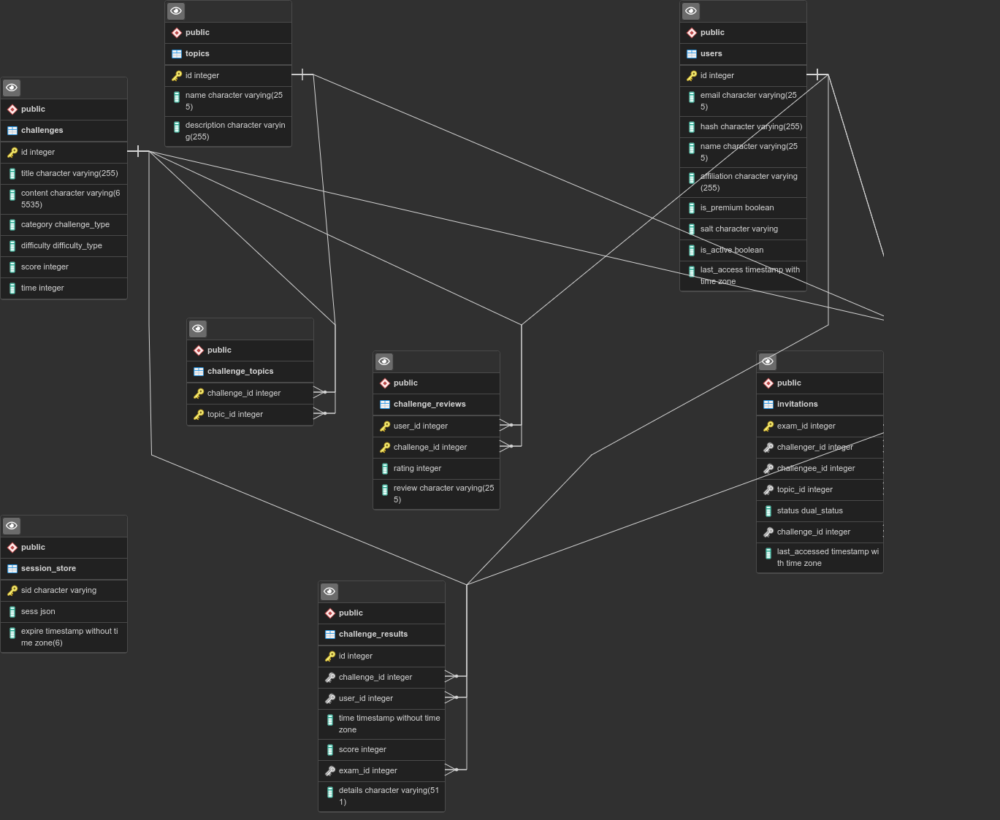

## How to set up database

-   Install PostgreSQL on your machine if it's not installed.
-   After installing, by default it makes a new user on our machine named "postgres".
-   User "postgres" is owner of PostgreSQL command line tool.
-   If you want to use this cli, you have to switch to "postgres" user.
-   Use `sudo -i -u postgres` (give password) to switch to "postgres" account.
-   Now you can run `psql` and enter into PostgreSQL command line.
-   In PostgreSQL command line, create a dedicated database for ICLP.
-   Run `CREATE DATABASE iclp_db;`(don't miss the semicolon).
-   It will create a database named "iclp_db". It's better to stick with this name. Otherwise, you will need to change environment variables in [.env](/../../.env) file.
-   After creating the database quit from PostgreSQL command line by giving `\q` command.
-   Now locate the dump file. Suppose, the dump file's absolute path is "infile.sql"
-   Run `psql iclp_db < infile.sql`. (Details are [here](https://www.postgresql.org/docs/9.1/backup-dump.html))
-   Now we have a ready database.
-   Note that, this dump is different than our previous dump. Database is slightly changed. If you had an existing database, you can drop that.

## ERD

### Note

Although git keeps track of dump, I will upload new dumps in separate file with timestamps.
